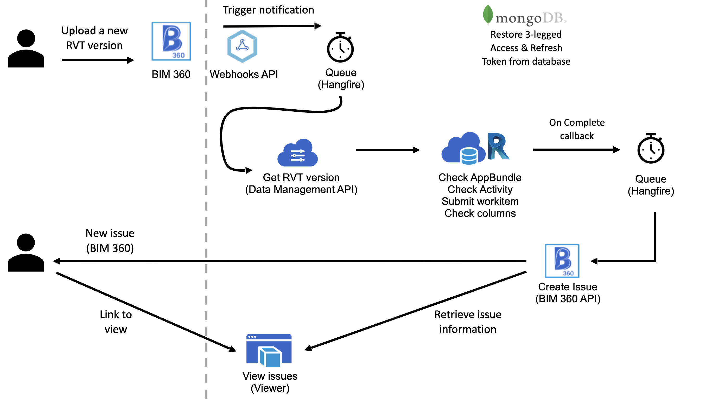

# design.automation-csharp-revit.check.issues


[](http://developer.autodesk.com/)
[](http://developer.autodesk.com/)
[](http://developer.autodesk.com/)
[](http://developer.autodesk.com/)


[](http://developer.autodesk.com/)


[](http://opensource.org/licenses/MIT)

# Description

This sample monitors a BIM 360 Folder for `version.added` event, when a new RVT file (or version) is uploaded, it triggers `Design Automation` for Revit to perform a basic design check, which generates a list of `externalId` of elements that did not pass the check. This information is used to create a BIM 360 Issue, which appears on BIM 360 UI with a link to a customer Viewer to display the elements with issues.

This sample is based on [this Webhook sample](https://github.com/Autodesk-Forge/data.management-csharp-webhook). Learn more about Webhooks and 3-legged Refresh & Access Token at [this blog post](https://forge.autodesk.com/blog/webhooks-and-bim-360-c). Also based on the [Learn Forge Tutorial](http://learnforge.autodesk.io).

## Thumbnail



## Demonstration

Whatch the recording at [Youtube](https://www.youtube.com/watch?v=j9EgshGh2is).

## Live version

Try it at [revitdesigncheck.herokuapp.com](https://revitdesigncheck.herokuapp.com), use the [FindColumns-Basic.rvt](https://github.com/Autodesk-Forge/design.automation-csharp-revit.check.issues/raw/master/samplefile/FindColumns-Basic.rvt) sample file.

# Setup

## Prerequisites

1. **Forge Account**: Learn how to create a Forge Account, activate subscription and create an app at [this tutorial](http://learnforge.autodesk.io/#/account/). 
2. **Visual Studio**: Either Community (Windows) or Code (Windows, MacOS).
3. **.NET Core** basic knowledge with C#
4. **ngrok**: Routing tool, [download here](https://ngrok.com/)
5. **MongoDB**: noSQL database, [learn more](https://www.mongodb.com/). Or use a online version via [Mongo Altas](https://www.mongodb.com/cloud/atlas) (this is used on this sample)
6. **AWS Account**: S3 buckets are used to store result files
7. **Revit** 2019: required to compile changes into the plugin

## Running locally

Clone this project or download it. It's recommended to install [GitHub desktop](https://desktop.github.com/). To clone it via command line, use the following (**Terminal** on MacOSX/Linux, **Git Shell** on Windows):

    git clone https://github.com/autodesk-forge/design.automation-csharp-revit.check.issues


**Visual Studio** (Windows):

Right-click on the project, then go to **Debug**. Adjust the settings as shown below. 

 

**Visual Sutdio Code** (Windows, MacOS):

Open the folder, at the bottom-right, select **Yes** and **Restore**. This restores the packages (e.g. Autodesk.Forge) and creates the launch.json file. See *Tips & Tricks* for .NET Core on MacOS.


**MongoDB**

[MongoDB](https://www.mongodb.com) is a no-SQL database based on "documents", which stores JSON-like data. For testing purpouses, you can either use local or live. For cloud environment, try [MongoDB Atlas](https://www.mongodb.com/cloud/atlas) (offers a free tier). With MongoDB Atlas you can set up an account for free and create clustered instances, intructions:

1. Create a account on MongoDB Atlas.
2. Under "Collections", create a new database (e.g. named `designcheck`) with a collection (e.g. named `users`).
3. Under "Command Line Tools", whitelist the IP address to access the database, [see this tutorial](https://docs.atlas.mongodb.com/security-whitelist/). If the sample is running on Heroku, you'll need to open to all (IP `0.0.0.0/0`). Create a new user to access the database. 

At this point the connection string should be in the form of `mongodb+srv://<username>:<password>@clusterX-a1b2c4.mongodb.net/designcheck?retryWrites=true`. [Learn more here](https://docs.mongodb.com/manual/reference/connection-string/)

There are several tools to view your database, [Robo 3T](https://robomongo.org/) (formerly Robomongo) is a free lightweight GUI that can be used. When it opens, follow instructions [here](https://www.datduh.com/blog/2017/7/26/how-to-connect-to-mongodb-atlas-using-robo-3t-robomongo) to connect to MongoDB Atlas.

**AWS Account**

Create an AWS Account, allow API Access, the `access key` and `secret key` will be used on this sample.

**ngrok**

Run `ngrok http 3000 -host-header="localhost:3000"` to create a tunnel to your local machine, then copy the address into the `FORGE_WEBHOOK_URL` environment variable.

**Environment variables**

At the `.vscode\launch.json`, find the env vars and add your Forge Client ID, Secret and callback URL. Also define the `ASPNETCORE_URLS` variable. The end result should be as shown below:

```json
"env": {
    "ASPNETCORE_ENVIRONMENT": "Development",
    "ASPNETCORE_URLS" : "http://localhost:3000",
    "FORGE_CLIENT_ID": "your id here",
    "FORGE_CLIENT_SECRET": "your secret here",
    "FORGE_CALLBACK_URL": "http://localhost:3000/api/forge/callback/oauth",
    "OAUTH_DATABASE": "mongodb+srv://<username>:<password>@clusterX-a1b2c4.mongodb.net/designcheck?retryWrites=true",
    "FORGE_WEBHOOK_URL": "your ngrok address here: e.g. http://abcd1234.ngrok.io",
    "AWS_ACCESS_KEY": "your AWS access key here",
    "AWS_SECRET_KEY": "your AWS secret key here"
},
```

**Revit plugin**

A compiled version of the `Revit` plugin (.bundles) is included on the `web` module, under `wwwroot/bundles` folder. Any changes on these plugins will require to create a new .bundle, the **Post-build** event should create it. Please [review the readme](https://github.com/Autodesk-Forge/design.automation-csharp-revit.check.issues/tree/master/revit).

Start the app.

Open `http://localhost:3000` to start the app, select a folder to start monitoring. Upload a new version of the Revit file (see `/samples` folder) and the process should start.You can monitor the Jobs via Hangfire dashboard: `http://localhost:3000/hangfire`. 

## Deployment

To deploy this application to Heroku, the **Callback URL** for Forge must use your `.herokuapp.com` address. After clicking on the button below, at the Heroku Create New App page, set your Client ID, Secret and Callback URL for Forge.

[](https://heroku.com/deploy)


# Further Reading

Documentation:

- [BIM 360 API](https://developer.autodesk.com/en/docs/bim360/v1/overview/) and [App Provisioning](https://forge.autodesk.com/blog/bim-360-docs-provisioning-forge-apps)
- [Data Management API](https://developer.autodesk.com/en/docs/data/v2/overview/)
- [Webhook](https://forge.autodesk.com/en/docs/webhooks/v1)
- [Design Automation](https://forge.autodesk.com/en/docs/design-automation/v3/developers_guide/overview/)

Desktop APIs:

- [Revit](https://knowledge.autodesk.com/support/revit-products/learn-explore/caas/simplecontent/content/my-first-revit-plug-overview.html)

Other APIs:

- [Hangfire](https://www.hangfire.io/) queueing library for .NET
- [MongoDB for C#](https://docs.mongodb.com/ecosystem/drivers/csharp/) driver
- [Mongo Altas](https://www.mongodb.com/cloud/atlas) Database-as-a-Service for MongoDB

### Known Issues

- **Webhook triggers twice** for new files, currently under investigation. 

### Tips & Tricks

This sample uses .NET Core and works fine on both Windows and MacOS, see [this tutorial for MacOS](https://github.com/augustogoncalves/dotnetcoreheroku).

### Troubleshooting

1. **Cannot see my BIM 360 projects**: Make sure to provision the Forge App Client ID within the BIM 360 Account, [learn more here](https://forge.autodesk.com/blog/bim-360-docs-provisioning-forge-apps). This requires the Account Admin permission.

2. **error setting certificate verify locations** error: may happen on Windows, use the following: `git config --global http.sslverify "false"`

## License

This sample is licensed under the terms of the [MIT License](http://opensource.org/licenses/MIT). Please see the [LICENSE](LICENSE) file for full details.

## Written by

Augusto Goncalves [@augustomaia](https://twitter.com/augustomaia), [Forge Partner Development](http://forge.autodesk.com)